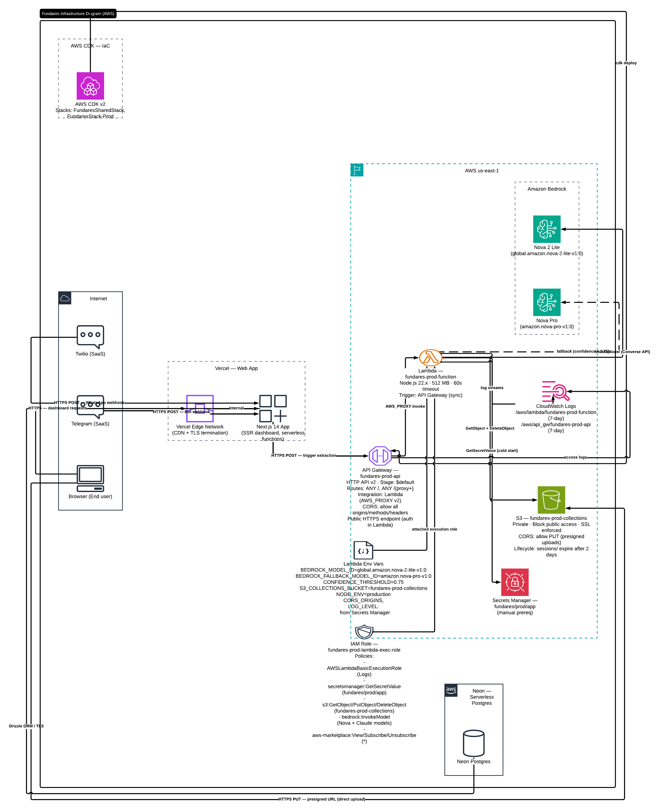

# Infrastructure Diagram — Fundares



---

## Diagram generation prompt

Use the following description to generate a cloud infrastructure diagram focused on deployed services and their connections. Do not include application code, business logic, or data flows — only infrastructure components, network boundaries, and service integrations.

---

## Prompt

Draw a cloud infrastructure diagram for a platform called **Fundares**. Use AWS architecture diagram conventions. Group resources into labeled boundaries. Use the official AWS service icon style where possible. Layout flows left to right: internet → edge → compute → AI → storage → database.

---

### Internet / External (left boundary — "Internet")

Three external origins that generate traffic:

- **Twilio** (SaaS) — sends HTTP POST to the webhook endpoint when a WhatsApp message arrives
- **Telegram** (SaaS) — sends HTTP POST to the webhook endpoint when a bot message arrives
- **Browser** (end user) — makes HTTPS requests to the web dashboard and directly uploads files to S3 via presigned URL

---

### Vercel (boundary — "Vercel — Web App")

- **Vercel Edge Network** — CDN + TLS termination for the Next.js app
- **Next.js 14 App** — server-side rendered dashboard, runs as serverless functions on Vercel infrastructure
  - Outbound: calls AWS API Gateway (HTTPS) to trigger AI extraction
  - Outbound: connects to Neon Postgres over TLS (DATABASE_URL)
  - Inbound: receives webhooks from Twilio and Telegram

---

### AWS (boundary — "AWS us-east-1")

#### API Gateway — "fundares-prod-api"
- Type: HTTP API v2
- Stage: `$default` (auto-deploy)
- Routes: `ANY /` and `ANY /{proxy+}` → Lambda (AWS_PROXY integration, payload format 2.0)
- CORS: all origins, methods, and headers allowed
- Access logs → CloudWatch log group `/aws/api_gw/fundares-prod-api`
- Public HTTPS endpoint, no auth at gateway level (auth handled inside Lambda)

#### Lambda — "fundares-prod-function"
- Runtime: Node.js 22.x
- Memory: 512 MB
- Timeout: 60 seconds
- Triggered by: API Gateway (synchronous invoke)
- Outbound connections:
  - **Bedrock** (AWS SDK, same region) — InvokeModel API
  - **S3** (AWS SDK) — GetObject, DeleteObject on `fundares-prod-collections`
  - **Secrets Manager** (AWS SDK) — GetSecretValue on `fundares/prod/app` at cold start
- Environment variables injected by CDK:
  - `BEDROCK_MODEL_ID` = `global.amazon.nova-2-lite-v1:0`
  - `BEDROCK_FALLBACK_MODEL_ID` = `amazon.nova-pro-v1:0`
  - `CONFIDENCE_THRESHOLD` = `0.75`
  - `S3_COLLECTIONS_BUCKET` = bucket name (resolved at deploy time)
  - `NODE_ENV` = `production`
  - `CORS_ORIGINS`, `LOG_LEVEL` → pulled from Secrets Manager at cold start
- Logs → CloudWatch log group `/aws/lambda/fundares-prod-function` (7-day retention)

#### Amazon Bedrock — AI inference
- **Nova 2 Lite** (`global.amazon.nova-2-lite-v1:0`) — primary model
  - Input: $0.10 / 1M tokens · Output: $0.40 / 1M tokens
  - Modalities: text, image (base64), video (S3 URI)
  - Invoked via Bedrock Converse API
- **Nova Pro** (`amazon.nova-pro-v1:0`) — fallback model
  - Input: $0.80 / 1M tokens · Output: $3.20 / 1M tokens
  - Triggered automatically when Nova 2 Lite confidence < 0.75
- Draw both models inside a **"Amazon Bedrock"** service boundary
- Draw a solid arrow from Lambda → Nova 2 Lite labeled "InvokeModel (Converse API)"
- Draw a dashed arrow from Lambda → Nova Pro labeled "fallback (confidence < 0.75)"

#### S3 — "fundares-prod-collections"
- Purpose: temporary staging for images and videos before Bedrock analysis
- Access: private (block all public access)
- SSL enforced
- CORS: allows PUT from any origin (browser direct upload via presigned URL)
- Lifecycle rule: objects under `sessions/` prefix expire after 2 days
- Two inbound connections:
  - **Browser → S3**: direct PUT via presigned URL (bypasses Lambda entirely)
  - **Lambda → S3**: GetObject (read for Bedrock), DeleteObject (cleanup after analysis)

#### Secrets Manager — "fundares/prod/app"
- Stores: `CORS_ORIGINS`, `LOG_LEVEL`
- Not managed by CDK — must be created manually before first deploy
- Lambda reads at cold start only (not per-request)
- Draw connection: Lambda → Secrets Manager labeled "GetSecretValue (cold start)"

#### IAM — "fundares-prod-lambda-exec-role"
- Attached to Lambda
- Policies:
  - `AWSLambdaBasicExecutionRole` → CloudWatch Logs
  - `secretsmanager:GetSecretValue` → `fundares/prod/app`
  - `s3:GetObject`, `s3:PutObject`, `s3:DeleteObject` → `fundares-prod-collections`
  - `bedrock:InvokeModel` → Nova 2 Lite, Nova Pro, Nova Lite, Claude Haiku 4, Claude Sonnet 4
  - `aws-marketplace:ViewSubscriptions`, `Subscribe`, `Unsubscribe` → `*` (Bedrock first-time activation)
- Draw IAM role as a badge or shield icon attached to the Lambda function

#### CloudWatch Logs
- Log group `/aws/lambda/fundares-prod-function` — 7-day retention
- Log group `/aws/api_gw/fundares-prod-api` — 7-day retention
- Draw as a single CloudWatch service icon receiving logs from both Lambda and API Gateway

---

### Neon (boundary — "Neon — Serverless Postgres")

- **Neon Postgres** — hosted serverless PostgreSQL
- Region: closest to Vercel deployment (us-east-1 or us-east-2)
- Connection: Next.js app connects over TLS via `DATABASE_URL` (connection pooling via Neon serverless driver)
- Draw a single database cylinder icon labeled "Neon Postgres"
- One inbound connection from Vercel Next.js app labeled "Drizzle ORM / TLS"

---

### CDK deployment pipeline (top boundary — "AWS CDK — IaC")

- **AWS CDK v2** — defines all AWS resources as TypeScript code
- **Two stacks:**
  - `FundaresSharedStack` — shared region-wide resources
  - `FundaresStack-Prod` — API Gateway, Lambda, S3, IAM, Secrets Manager reference
- Draw CDK as a deployment arrow pointing into the AWS boundary labeled "cdk deploy"

---

### Layout guidance

```
[Internet]          [Vercel]              [AWS us-east-1]                    [Neon]
                                    ┌─────────────────────────────┐
Twilio ──────►  ┌────────────┐      │  API Gateway (HTTP v2)      │
                │  Next.js   │─────►│       │                     │
Telegram ──────►│  App       │      │       ▼                     │
                │  (Vercel)  │      │  Lambda (Node 22, 512MB)    │──► Bedrock Nova 2 Lite
Browser ───────►│            │      │       │          │          │       │
    │           └────────────┘      │       ▼          ▼          │    (fallback)
    │                  │            │  Secrets Mgr    S3 bucket   │──► Bedrock Nova Pro
    │                  └────────────┼──────────────────────────── │
    │                               │  CloudWatch Logs            │
    └──────── presigned PUT ───────►│  S3 bucket                  │
                                    └─────────────────────────────┘
         └──────────────────────────────────────────────────────────────► Neon Postgres
```

- Place **API Gateway** at the top of the AWS boundary as the entry point
- Place **Lambda** in the center of AWS boundary, with arrows going out to Bedrock, S3, and Secrets Manager
- Place **Bedrock** to the right of Lambda with both models visible
- Place **S3** below Lambda
- Place **Secrets Manager** and **CloudWatch** as supporting services around Lambda
- Place **Neon** outside AWS boundary on the right, connected from Vercel
- Place **IAM role** as a badge on Lambda

---

### Connection summary

| From | To | Protocol / Label |
|------|----|-----------------|
| Twilio | Vercel Next.js | HTTPS POST — WhatsApp webhook |
| Telegram | Vercel Next.js | HTTPS POST — Bot webhook |
| Browser | Vercel Next.js | HTTPS — dashboard requests |
| Browser | S3 | HTTPS PUT — presigned URL (direct upload) |
| Vercel Next.js | API Gateway | HTTPS POST — trigger extraction |
| Vercel Next.js | Neon Postgres | TLS — Drizzle ORM queries |
| API Gateway | Lambda | AWS_PROXY invoke |
| Lambda | Bedrock Nova 2 Lite | AWS SDK — InvokeModel (Converse API) |
| Lambda | Bedrock Nova Pro | AWS SDK — InvokeModel (fallback, dashed) |
| Lambda | S3 | AWS SDK — GetObject + DeleteObject |
| Lambda | Secrets Manager | AWS SDK — GetSecretValue (cold start only) |
| Lambda | CloudWatch | SDK / runtime — log streams |
| API Gateway | CloudWatch | Access logs |
| CDK | AWS | cdk deploy — provisions all resources |
